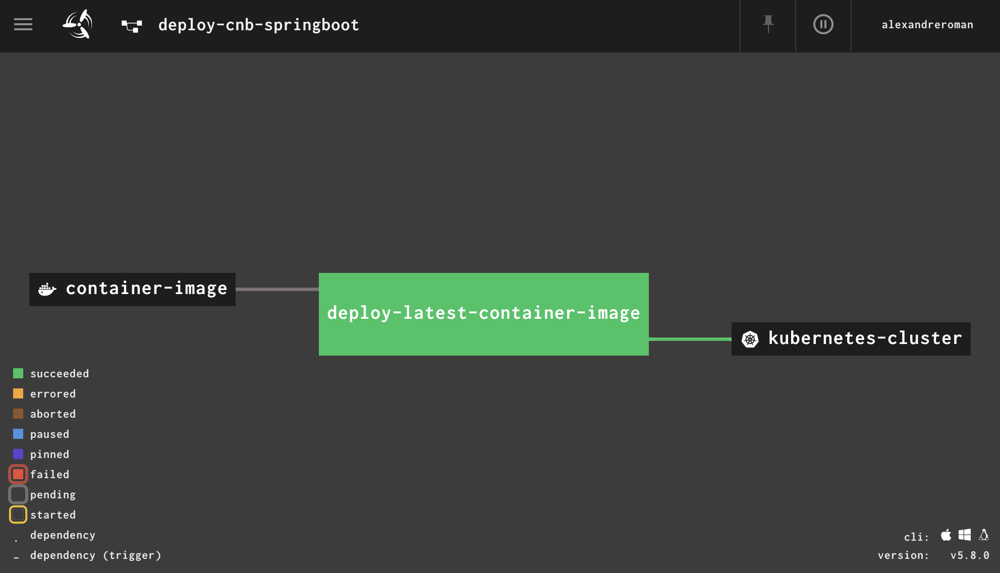

# Deploying apps to Kubernetes using Concourse

This project defines a simple [Concourse](https://concourse-ci.org) pipeline which is
responsible for monitoring images in a container registry (such as Docker Hub or Harbor):
new container images are automatically deployed to your Kubernetes cluster.



## How to use it?

Create a pipeline configuration file from `vars.template.yml`:
```yaml
kubernetes-config: |
  >--- PASTE YOUR .kube/config HERE ---<

# Set the container image you want to monitor and deploy to your cluster.
container-image: alexandreroman/cnb-springboot

# Set target Kubernetes deployment.
kubernetes-namespace: cnb-springboot
kubernetes-deployment: app
kubernetes-container: app

# Select a context from the Kubernetes config. Leave empty to use default context.
kubernetes-context:

# Match this attribute with your cluster version.
kubernetes-version: 1.15

# Set to true to disable TLS verification when using kubectl commands.
kubernetes-skip-tls-verification: false

# Set how long to wait for pods to run (seconds), 0 means "don't wait".
kubernetes-wait-until-ready: 120
```

Use `fly` CLI to create a Concourse pipeline instance:
```bash
$ fly -t myconcourse set-pipeline -p deploy-myapp -c pipeline.yml -l myapp.yml
```

You're done!

At this point, when a new container image appears in the container registry, a Kubernetes
`Deployment` object will be patched: the new container image will be used.
If you previously configured your `Deployment` instance with a
[readiness probe](https://github.com/alexandreroman/cnb-springboot/blob/master/k8s/02-deployment.yml#L28),
Kubernetes will rollout the new version with no app downtime.

## Contribute

Contributions are always welcome!

Feel free to open issues & send PR.

## License

Copyright &copy; 2020 [VMware, Inc](https://vmware.com).

This project is licensed under the [Apache Software License version 2.0](https://www.apache.org/licenses/LICENSE-2.0).
